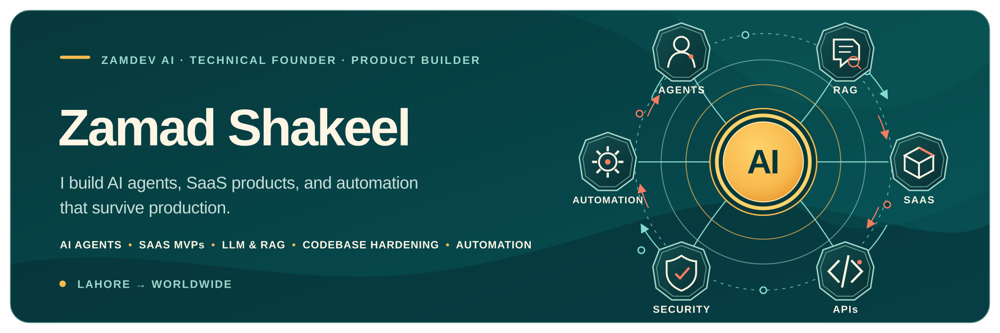

<div align="center">
  
</div>

<div align="center">
  <a href="https://zamdevai.com"></a>
  <a href="https://www.linkedin.com/in/zamad-gopang/"></a>
  <a href="mailto:hello@zamdevai.com"></a>
  <a href="./zamad_resume.pdf"></a>
</div>

<br />

<div align="center">
  <h3>Founder at <a href="https://zamdevai.com">ZamDev AI</a> · AI Systems Builder · Full-Stack Engineer</h3>
  <p>
    I turn ambitious product ideas—and fragile AI-built MVPs—into secure, observable,<br />
    production-ready systems that teams can confidently operate and scale.
  </p>
  <p><strong>Based in Lahore · Building for teams worldwide</strong></p>
</div>

---

## What I build

- **AI agents with real control planes** — durable state, approval gates, audit trails, evaluation loops, and safe tool use.
- **SaaS products that survive launch day** — authentication, billing, real-time systems, background jobs, observability, and deployment.
- **Secure foundations for AI-built MVPs** — RLS policies, server-side secrets, query tuning, clean architecture, and automated regression tests.
- **Custom operational software** — ERPs, marketplaces, document intelligence, workflow automation, and internal command centers.

> My rule: an impressive demo earns attention; a reliable system earns trust.

## Selected work

### ApnaTask — trust-first, hyperlocal services marketplace

A two-sided mobile marketplace with geospatial provider matching, real-time WebSocket bidding, wallet guardrails, and asynchronous notifications. Its current backend and mobile-client suites carry **98 passing automated tests**.

[Backend](https://github.com/zamadshakil/apnatask) · [React Native client](https://github.com/zamadshakil/apnatask_frontend)

`FastAPI` `React Native` `PostGIS` `Redis` `Celery` `WebSockets`

### [ZamDev Tools](https://tools.zamdevai.com) — 35+ privacy-first browser utilities

An offline-capable developer toolkit with zero-upload image tools, formatters, generators, an SEO auditor, and a Python 3.11 compiler powered by Pyodide and WebAssembly.

`Next.js` `TypeScript` `Pyodide` `WebAssembly` `PWA` `PageSpeed API`

### [Hierarchia](https://showcase.system.zamdevai.com) — AI document review for audit teams

A document-intelligence platform that evaluates field reports against plain-English validation rules in under 60 seconds, then surfaces scores, risk flags, deadlines, and audit history across a role-aware operations workspace.

`Next.js` `Supabase` `RAG` `pgvector` `RBAC` `Document AI`

<details>
  <summary><strong>More shipped systems</strong></summary>
  <br />

- **xITAD ERP** — chain-of-custody tracking, warehouse inventory, granular RBAC, and automated destruction certificates for IT asset disposition operations.
- **Super Mini Print Shop** — artwork validation, dynamic pricing, Stripe payments, and automated routing to third-party fulfilment.
- **WriteAI.me** — multi-model AI writing SaaS with 80+ templates, agent workflows, subscriptions, and containerized deployment.
</details>

## How I engineer

```text
Explicit state  →  deterministic workflows  →  observable outcomes
Least privilege →  secure boundaries        →  safer production systems
Automated tests →  repeatable verification  →  confident releases
Clean handoff   →  documented ownership     →  no vendor lock-in
```

I prefer boring reliability over hidden magic: persisted state instead of fabricated status, idempotency instead of duplicate side effects, and failure states that say exactly what went wrong.

## Core stack

<div align="center">
  
</div>

<br />

| Layer | Tools I reach for |
| --- | --- |
| **AI systems** | LangGraph, LangChain, CrewAI, MCP, RAG, pgvector, Pinecone, Qdrant |
| **Product engineering** | Next.js, React, React Native, FastAPI, Node.js, REST, WebSockets |
| **Data & async work** | PostgreSQL, PostGIS, Supabase, Redis, Celery, queues, background workers |
| **Delivery & quality** | Docker, Terraform, AWS, Cloudflare, GitHub Actions, Playwright, CI/CD |

## Beyond the code

- Founder and CEO of **[ZamDev AI](https://zamdevai.com)**, a focused engineering studio for AI products, SaaS, and automation.
- BS Artificial Intelligence student at the **University of Central Punjab**.
- Trained in agentic AI through **IBM** and machine learning through **Stanford Online / DeepLearning.AI**.
- Interested in the hard parts of software: state, trust boundaries, concurrency, failure recovery, and operability.

## Let’s build something that ships

I work best with founders and product teams who need a hands-on technical partner for a new build, an AI integration, or a codebase that must become production-ready.

<div align="center">
  <a href="mailto:hello@zamdevai.com"><strong>hello@zamdevai.com</strong></a>
  &nbsp;·&nbsp;
  <a href="https://zamdevai.com">zamdevai.com</a>
  &nbsp;·&nbsp;
  <a href="https://www.linkedin.com/in/zamad-gopang/">LinkedIn</a>
  &nbsp;·&nbsp;
  <a href="https://x.com/zamadshakil">X / Twitter</a>
</div>

<br />

<div align="center">
  <sub>Build the smallest system that can be trusted—then make it scale.</sub>
</div>
